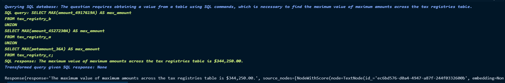

# ABOUT
This Hackathon Goal is to tried to come ups with the ideas that utilize LLM to help automate Data Scientist workflow 

# My approachs
I tried to use both Langchain and Llama Index to create an automation that might help DataScientist to their work

## My ideas
- RAG for feature engineering
- RAG + Table QA for doing the basic sql queries
- RAG + custom visualization Agent to automate visualization

## Sample Output
Q: Is there a correlation between the number of installments and the interest rate for credit cases ?

Q: What is the maximum value of maximum amounts across the tax registries table ?

