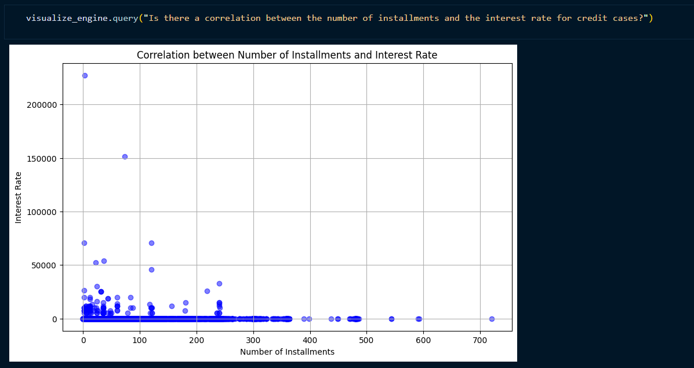
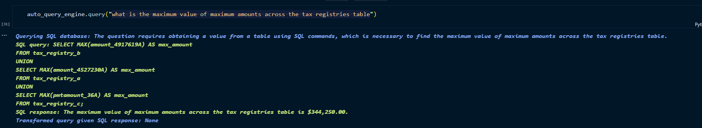
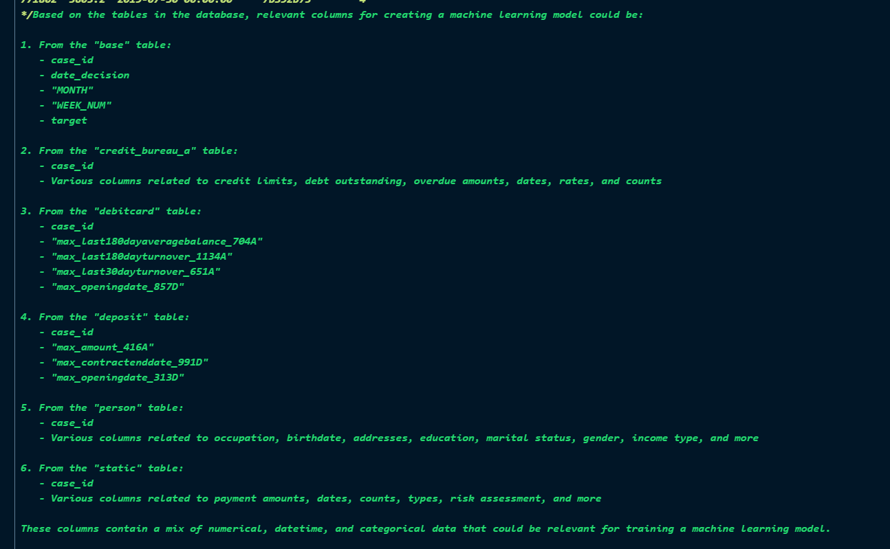

# ABOUT
This one of my work in the Hackathon of SuperAI SS4. The Goal is to tried to come ups with the ideas that utilize LLM to help automate Data Scientist workflow.
In this Project, I tried to utilize Langchain and Llama Index to create an automation that might help assist Data Scietist in their EDA and give idea on feature engineering.

## My ideas
- RAG for feature engineering
- RAG + Table QA for doing the basic sql queries
- RAG + custom visualization Agent to automate visualization

## Data
https://www.kaggle.com/competitions/home-credit-credit-risk-model-stability

## Sample Output
### Visualization
Q: Is there a correlation between the number of installments and the interest rate for credit cases ?

### Table QA
Q: What is the maximum value of maximum_amounts across the tax registries table ?
A: The maximum value of maximum_amounts across the tex registries table is $344,250.

### RAG
Q: From all the table name base, if I were to create a ml model which columns should be relevant.

